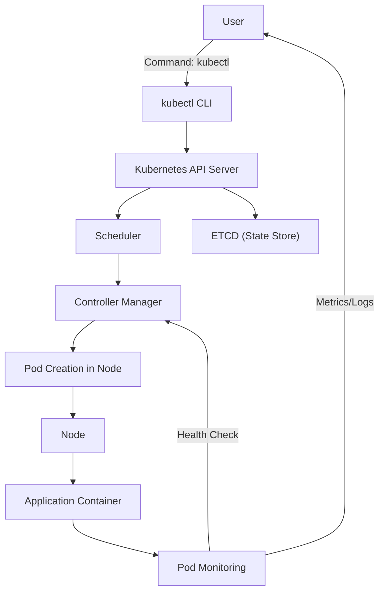

# Pengenalan Kubernetes 🚀

## Apa itu Kubernetes (k8s)? 🤔
1. Kubernetes atau disingkat k8s adalah platform open-source yang super keren untuk otomatisasi proses deployment, scaling, dan manajemen aplikasi container. 🔄📦
2. K8s bikin hidup lebih gampang karena bisa ngatur aplikasi yang dikemas dalam container di berbagai lingkungan seperti cloud, on-premise, atau hybrid tanpa ribet. 🌐☁️
3. K8s sekarang jadi platform orkestrasi container paling populer di dunia. Banyak banget dipakai tim DevOps dan engineer infrastruktur buat bikin aplikasi yang scalable dan efisien. 🛠️🔥

## Sejarah Kubernetes 📜
1. Awalnya, Google bikin sistem internal bernama Borg buat ngatur ribuan server mereka. 😲💻
2. Pengalaman dari pengembangan Borg yang berevolusi jadi Omega kasih Google banyak pelajaran buat bikin sesuatu yang lebih canggih lagi. 💡💪
3. Tahun 2014, Google akhirnya ngenalin Kubernetes sebagai proyek open-source yang ngambil pelajaran dari semua pengalaman manajemen infrastruktur skala besar mereka. 🌍👩‍💻
4. Sejak launching, Kubernetes langsung melejit dan jadi standar utama buat orkestrasi container, didukung sama komunitas yang gede banget di seluruh dunia. 🌐❤️

## Visualisasi Workflow Kubernetes 🛠️
Di bawah ini adalah visualisasi alur kerja Kubernetes yang nunjukkin interaksi antara komponen-komponen pentingnya. Mulai dari user yang ngirim perintah, sampai aplikasi container yang akhirnya berjalan di <b>pod</b>.

### Penjelasan Workflow 🧩
1. User: Ngirim perintah lewat kubectl, kayak kubectl apply, buat deploy atau ngatur aplikasi. 💻🚀
2. kubectl: Antarmuka (CLI) yang kirim perintah ke API Server Kubernetes buat dijalanin. 🖥️📡
3. API Server: Otak dari Kubernetes! 🧠 Dia terima semua permintaan dari kubectl dan atur komunikasi ke komponen lainnya.
4. Scheduler: Pilih Node terbaik buat jalankan pod berdasarkan resource yang ada dan aturan yang ditetapkan. 📝📊
5. Controller Manager: Ngurus lifecycle dari pod, jaga biar jumlah pod sesuai yang dibutuhkan dan monitor kondisinya. 👀🔄
6. ETCD: Tempat penyimpanan seluruh state cluster, kaya database yang disimpan dalam bentuk key-value. 💾🔑
7. Pod: Unit dasar deployment yang berjalan di Node, isinya container yang jalanin aplikasi. 📦🛠️
8. Node: Mesin (fisik atau virtual) tempat pod dijalankan. Bisa di cloud, server lokal, atau hybrid. ☁️💻
9. Pod Monitoring: Sistem yang terus-terusan cek kondisi pod, kirim log/metrics ke user, dan pastiin aplikasinya sehat terus. ⚕️📊

