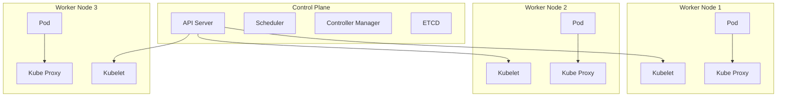

# Arsitektur Kubernetes 🏗️

Kubernetes punya arsitektur yang cukup fleksibel dan scalable. Dalam sistem ini, ada dua komponen besar: Control Plane dan Worker Nodes. Yuk, kita bahas masing-masing!

1. Control Plane 🧠
Control Plane adalah pusat kontrolnya Kubernetes. Semua keputusan mengenai scheduling, maintenance, dan scaling aplikasi ada di sini. Ini komponen utamanya:

    a. API Server 📡
    API Server adalah jantungnya Kubernetes. Setiap kali kita kirim perintah dengan kubectl, API Server yang pertama kali menerima dan memprosesnya. Semua komponen lain berkomunikasi lewat API Server ini.

    b. ETCD 💾
    ETCD adalah database penyimpanan semua "state" atau kondisi cluster Kubernetes. Semua konfigurasi dan informasi mengenai pod, service, deployment, dan state lainnya disimpan di sini.

    c. Scheduler 📅
    Scheduler bertanggung jawab buat nyari node yang paling pas untuk menjalankan pod. Scheduler akan mengecek resource yang tersedia di setiap node (CPU, memori, dsb.) dan pilih node yang paling sesuai dengan kebutuhan.

    d. Controller Manager 🛠️
    Controller Manager adalah komponen yang selalu memantau cluster dan memastikan semua sesuai dengan yang diinginkan (desired state). Misalnya, kalau ada pod yang mati, Controller Manager akan memastikan pod baru dibuat untuk menggantikannya.

2. Worker Nodes 🚀
Worker Nodes adalah mesin (fisik atau virtual) yang menjalankan aplikasi kamu. Setiap Worker Node punya komponen-komponen penting ini:

    a. Kubelet 🤖
    Kubelet adalah agen yang berjalan di setiap node dan bertanggung jawab untuk memastikan bahwa container di dalam pod berjalan dengan baik. Dia berkomunikasi dengan API Server buat dapetin perintah.

    b. Container Runtime 🐳
    Container runtime adalah software yang digunakan buat menjalankan container. Contoh container runtime yang populer adalah Docker. Kubernetes butuh container runtime supaya bisa ngejalanin pod-pod yang berisi container.

    c. Kube Proxy 🛡️
    Kube Proxy adalah komponen yang bertanggung jawab buat networking di dalam Kubernetes. Dia memastikan setiap pod bisa berkomunikasi dengan pod lain atau service di dalam cluster, dan bisa menerima traffic dari luar cluster juga.

3. Pod 📦
Nah, ini yang paling penting. Pod adalah unit paling kecil dalam Kubernetes yang berisi container atau beberapa container. Pod biasanya dibikin buat ngejalanin satu aplikasi, misalnya satu microservice, dan punya alamat IP sendiri di dalam cluster.

# Visualisasi Sederhana Arsitektur Kubernetes

