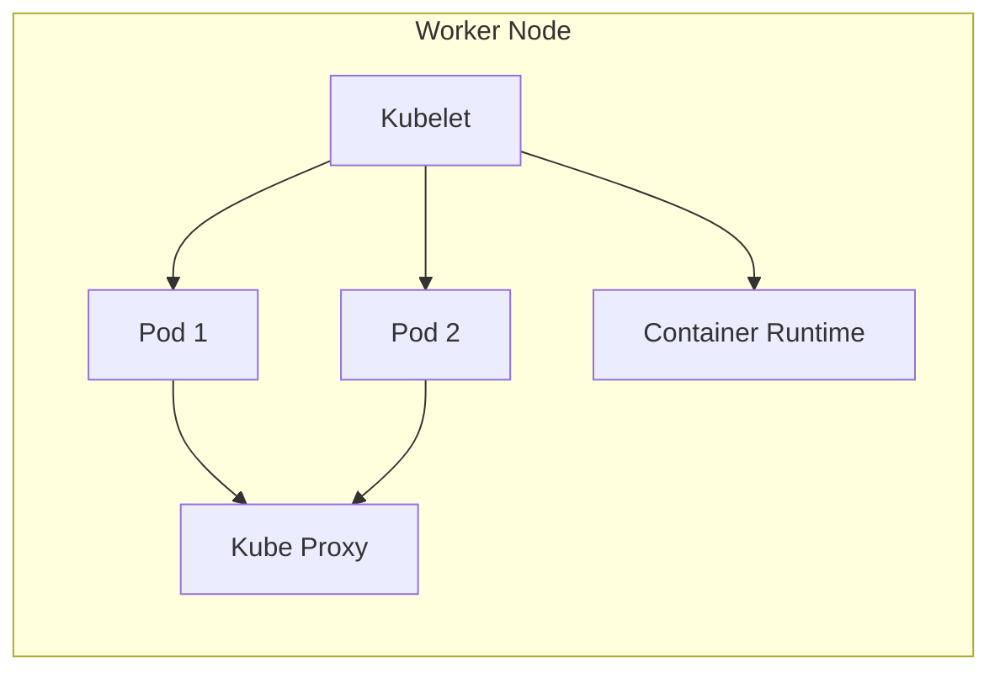

# Node di Kubernetes 🖥️

Setiap aplikasi yang jalan di Kubernetes itu selalu dijalankan di atas Node. Jadi, Node adalah salah satu komponen paling penting dalam arsitektur Kubernetes. Di chapter ini, kita akan bahas apa itu Node, komponen-komponen yang ada di dalamnya, dan bagaimana peran Node dalam ekosistem Kubernetes.

# Apa itu Node? 🤔
Secara sederhana, Node adalah mesin tempat Kubernetes menjalankan pod. Node bisa berupa mesin fisik atau mesin virtual, tergantung di mana cluster Kubernetes kamu di-deploy (misalnya, di cloud seperti GCP, AWS, atau Azure, atau di server lokal).

Setiap Worker Node di Kubernetes punya beberapa komponen penting yang memastikan bahwa pod berjalan dengan baik dan bisa saling berkomunikasi.

# Komponen-Komponen Node 🛠️
1. Kubelet 🤖
Kubelet adalah agen utama di dalam setiap node. Fungsinya memastikan bahwa pod-pod yang dijadwalkan oleh API Server berjalan dengan benar di node tersebut. Kubelet akan terus-menerus memeriksa apakah pod-pod yang ada dalam node sehat dan berjalan sesuai yang diharapkan. Kalau ada yang nggak beres, Kubelet bakal laporan balik ke Control Plane.

2. Container Runtime 🐳
Ini adalah software yang bertanggung jawab buat menjalankan container-container di dalam pod. Docker adalah contoh container runtime yang paling umum digunakan, tapi Kubernetes juga support container runtimes lain seperti containerd dan CRI-O. Fungsinya adalah mengelola lifecycle container—mulai dari pull image, start, sampai menghentikan container.

3. Kube Proxy 🛡️
Kube Proxy bertugas buat mengatur network di Kubernetes. Dia bikin aturan iptables supaya pod bisa saling berkomunikasi satu sama lain, dan juga handle traffic dari luar cluster yang masuk ke service di dalam cluster. Jadi, Kube Proxy ini bisa dianggap sebagai "penjaga gerbang" dari node.

4. Pod 📦
Pod adalah unit paling dasar di Kubernetes yang berisi satu atau lebih container. Setiap node bisa punya beberapa pod yang dijalankan, dan pod-pod ini lah yang menjalankan aplikasi kamu. Setiap pod punya IP sendiri, dan bisa berkomunikasi dengan pod lain di dalam cluster lewat network yang diatur oleh Kubernetes.

# Bagaimana Node Bekerja? 🔄
Ketika kamu deploy aplikasi ke Kubernetes, Scheduler akan memilih Node yang tepat buat menjalankan Pod yang dibutuhkan. Scheduler mempertimbangkan resource yang ada di setiap Node (seperti CPU, memori, dan storage), kemudian memilih node yang paling sesuai dengan kebutuhan pod yang akan dijalankan.

Setelah pod dijadwalkan di node, Kubelet akan memastikan pod tersebut berjalan dengan baik. Kalau pod gagal atau mati, Kubelet akan mencoba memulai ulang pod tersebut atau laporan ke Controller Manager biar pod baru bisa dibuat.

# Visualisasi Node di Kubernetes

