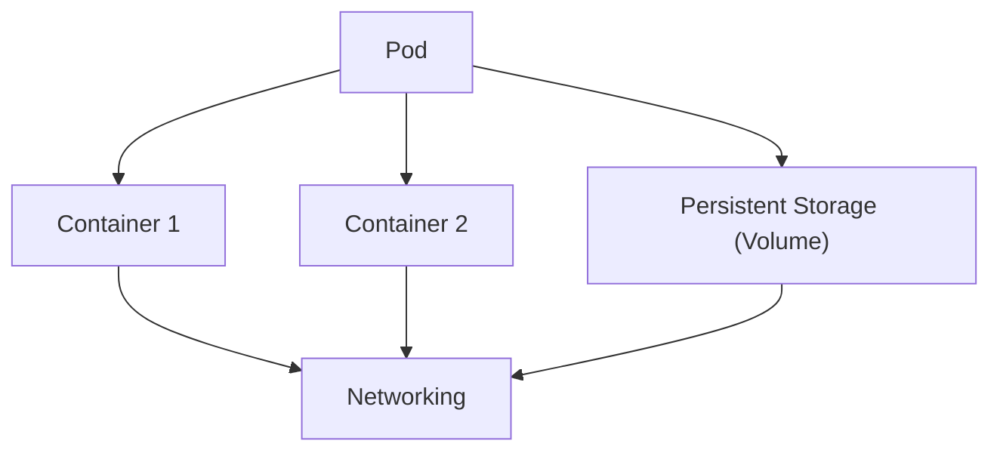

# Mengenal Pod di Kubernetes 📦
Setelah memahami Node, sekarang saatnya kita masuk ke komponen paling kecil tapi super penting di Kubernetes, yaitu Pod. Pod adalah unit paling dasar yang menjalankan aplikasi dalam cluster Kubernetes. Semua container di Kubernetes ada di dalam pod ini, jadi pod bisa dianggap sebagai "rumah" untuk container.

## Apa Itu Pod? 🤔
Pod adalah unit terkecil di Kubernetes yang berisi satu atau lebih container. Pod dirancang untuk menjalankan satu aplikasi atau layanan tertentu. Kalau kamu punya beberapa container yang perlu berbagi resource dan berkomunikasi dengan cepat (misalnya satu container web server dan satu container proxy), kamu bisa menjalankannya di dalam satu pod.

## Karakteristik Utama Pod:
- Pod punya IP sendiri: Setiap pod di Kubernetes punya alamat IP unik di dalam cluster, jadi container di dalam pod bisa saling berkomunikasi dengan container lain di pod yang berbeda.
- Pod ephemeral: Pod itu sifatnya sementara. Kalau pod mati atau terhapus, Kubernetes akan membuat pod baru dengan konfigurasinya, tapi pod yang baru ini akan punya IP berbeda.
- Pod bisa punya satu atau lebih container: Meskipun kebanyakan pod hanya punya satu container, ada situasi di mana satu pod bisa punya beberapa container, terutama kalau container-container ini saling bergantung satu sama lain.

## Pod vs Container, Apa Bedanya? 🧐
Kadang ada kebingungan antara pod dan container, jadi biar lebih jelas:

- Container adalah unit yang mengemas aplikasi dan semua dependensinya (seperti library, konfigurasi, dll).
- Pod adalah wrapper untuk container di Kubernetes. Satu pod bisa punya satu container atau lebih, tapi biasanya satu pod untuk satu container. Pod mengatur bagaimana container berkomunikasi dan berbagi resource.

## Struktur Pod 📦
Setiap pod punya beberapa komponen penting:

1. Containers: Container yang menjalankan aplikasi kamu.
2. Networking: Setiap pod punya IP unik di dalam cluster, sehingga memungkinkan komunikasi antar pod atau layanan.
3. Storage: Pod bisa mengakses volumes untuk menyimpan data yang tetap ada walaupun pod-nya mati atau restart.

## Cara Membuat Pod 🛠️
Untuk membuat pod, kamu biasanya pakai YAML file buat mendefinisikan pod dan container yang ada di dalamnya. Ini contoh sederhana file YAML buat bikin pod:

```yaml
apiVersion: v1
kind: Pod
metadata:
  name: nginx
spec:
  containers:
  - name: nginx
    image: nginx
    ports:
    - containerPort: 80
    resources:
      limits:
        memory: "128Mi"
        cpu: "500m"
```

## Penjelasan YAML:
- apiVersion: Versi API Kubernetes.
- kind: Menentukan bahwa ini adalah sebuah pod.
- metadata: Berisi nama pod.
- spec: Spesifikasi pod, termasuk container yang akan dijalankan.
- containers: Berisi detail container (nama, image, dan port).

Untuk menjalankan pod ini, kamu tinggal gunakan command berikut:

```bash
kubectl apply -f nginx-pod.yaml
```

## Melihat Pod yang Berjalan 🧐
Setelah pod dibuat, kamu bisa cek apakah pod tersebut sudah berjalan atau belum dengan perintah ini:

```bash
kubectl get pods
```

## Output Contoh:
```bash
NAME         READY   STATUS    RESTARTS   AGE
nginx-pod    1/1     Running   0          5m
```

## Penjelasan:
- READY: Menunjukkan jumlah container di pod yang sudah siap (misal 1/1 berarti container sudah siap).
- STATUS: Status pod, apakah Running, Pending, atau Failed.
- RESTARTS: Berapa kali pod sudah restart.
- AGE: Sudah berapa lama pod tersebut berjalan.

## Pod Lifecycle 🔄
Pod di Kubernetes punya siklus hidup tertentu, dan siklus ini diatur oleh Kubelet di dalam Node. Ada beberapa status utama dalam lifecycle pod:

1. Pending: Pod sudah dibuat, tapi container di dalamnya belum jalan.
2. Running: Pod sudah berhasil jalan dan container di dalamnya sedang berjalan.
3. Succeeded: Pod selesai menjalankan tugasnya dan sudah mati.
4. Failed: Pod gagal menyelesaikan tugasnya, dan tidak bisa dipulihkan lagi.
5. CrashLoopBackOff: Pod terus mencoba restart tapi gagal.

## Visualisasi Pod di Kubernetes

