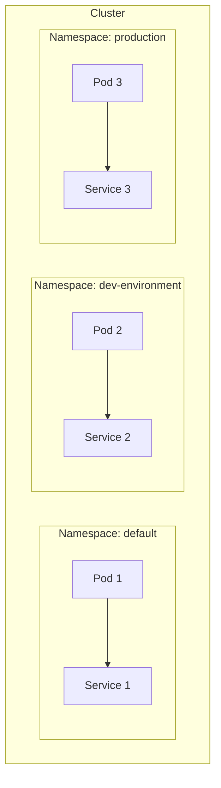

# Namespace di Kubernetes 🗂️

Di Kubernetes, Namespace berfungsi seperti pembatas atau kotak terpisah untuk resource yang ada di dalam cluster. Saat kamu punya banyak aplikasi atau tim yang bekerja di satu cluster, namespace membantu kamu menjaga keteraturan dan mengelompokkan resource agar nggak bercampur aduk. Jadi, namespace bisa dianggap sebagai cara untuk membagi "ruangan" dalam cluster yang sama.

## Apa Itu Namespace? 🤔
Namespace adalah cara Kubernetes untuk membagi resource ke dalam grup-grup yang terpisah. Dengan namespace, kamu bisa membuat environment yang berbeda dalam satu cluster, misalnya untuk development, staging, dan production. Setiap namespace memiliki resource-nya sendiri, dan pod, service, atau resource lain di satu namespace tidak bisa berinteraksi langsung dengan resource di namespace lain, kecuali secara eksplisit diatur.

## Contoh Penggunaan Namespace:
- Development, staging, dan production: Kamu bisa memisahkan environment yang berbeda dengan namespace yang berbeda.
- Team-based namespaces: Jika banyak tim menggunakan cluster yang sama, kamu bisa memberikan satu namespace per tim.
- Multi-tenant clusters: Jika kamu menjalankan beberapa aplikasi atau layanan dalam satu cluster, namespace membantu agar resource tidak bercampur.

## Namespace Default
Kubernetes sudah punya beberapa namespace bawaan:

- default: Namespace ini digunakan kalau kamu nggak spesifik menaruh resource di namespace tertentu.
- kube-system: Namespace khusus untuk resource internal Kubernetes, seperti controller, API server, dll.
- kube-public: Namespace untuk resource yang bersifat publik dan bisa diakses oleh semua user di cluster.

## Cara Membuat Namespace 🛠️
### Membuat Namespace dengan YAML:
Kamu bisa membuat namespace baru dengan file YAML seperti ini:
```yaml
apiVersion: v1
kind: Namespace
metadata:
  name: dev-environment
```
Untuk menerapkan namespace ini di cluster kamu, gunakan perintah:
```bash
kubectl apply -f namespace.yaml
```
### Membuat Namespace dengan kubectl:
Selain pakai YAML, kamu bisa langsung bikin namespace dengan perintah ini:
```bash
kubectl create namespace dev-environment
```

## Cara Menggunakan Namespace 🌐
Setelah namespace dibuat, kamu bisa menaruh resource di namespace itu dengan menambahkannya di YAML file:
```yaml
apiVersion: v1
kind: Pod
metadata:
  name: nginx-pod
  namespace: dev-environment
spec:
  containers:
  - name: nginx-container
    image: nginx:latest
```
Dalam contoh ini, nginx-pod akan dijalankan di namespace dev-environment. Jadi, resource ini akan terisolasi dari resource di namespace lain.

## Cara Melihat Namespace 📊
Untuk melihat daftar namespace yang ada di cluster kamu, gunakan perintah ini:
```bash
kubectl get namespaces
```
## Output Contoh:
```bash
NAME              STATUS   AGE
default           Active   30d
kube-system       Active   30d
kube-public       Active   30d
dev-environment   Active   5d
```
## Melihat Resource dalam Namespace Tertentu:
Kamu bisa melihat semua pod di namespace tertentu dengan perintah:
```bash
kubectl get pods -n dev-environment
```

Atau, jika kamu ingin mengecek service, gunakan:
```bash
kubectl get services -n dev-environment
```

## Mengubah Namespace Default ⚙️
Kalau kamu nggak mau selalu menyebutkan namespace setiap kali menjalankan perintah, kamu bisa mengubah namespace default dengan perintah ini:
```bash
kubectl config set-context --current --namespace=dev-environment
```

Setelah ini, setiap perintah kubectl akan otomatis dijalankan di namespace dev-environment.

## Visualisasi Namespace di Kubernetes

